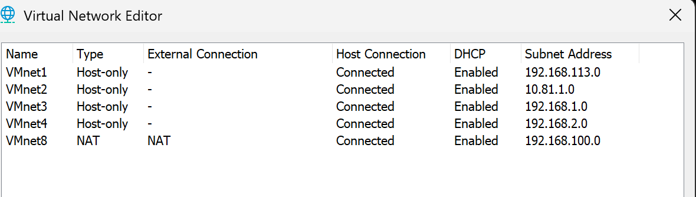
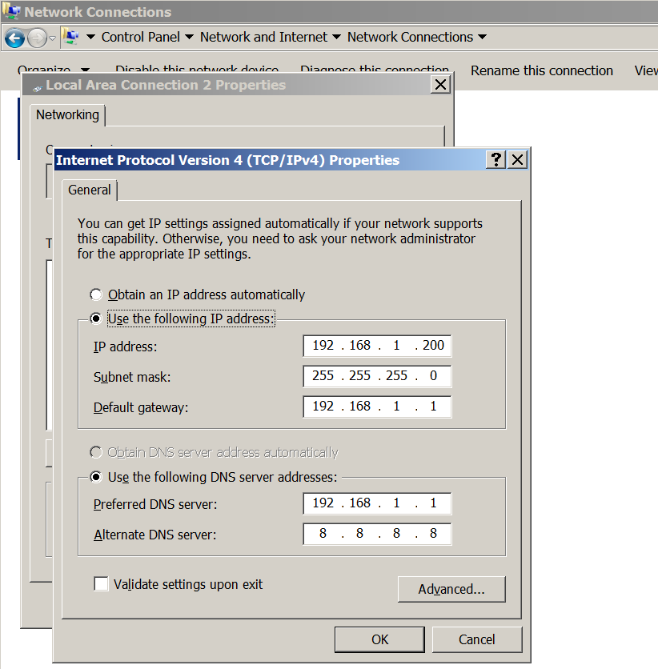
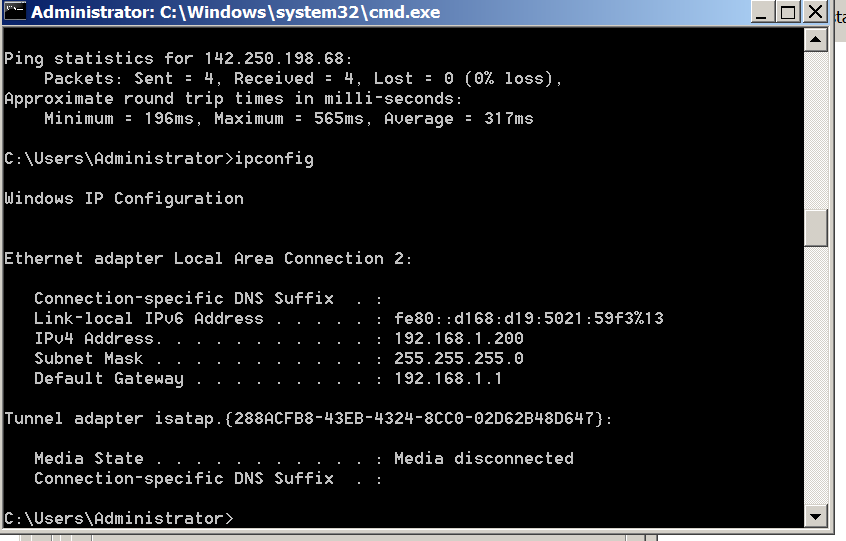
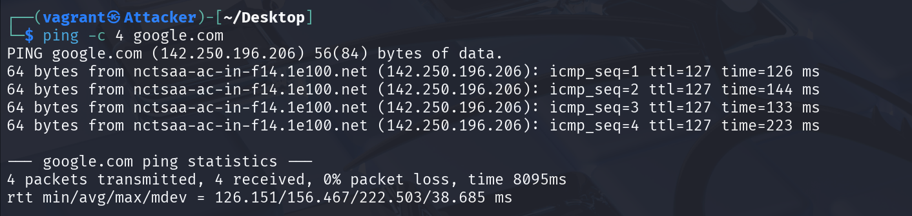
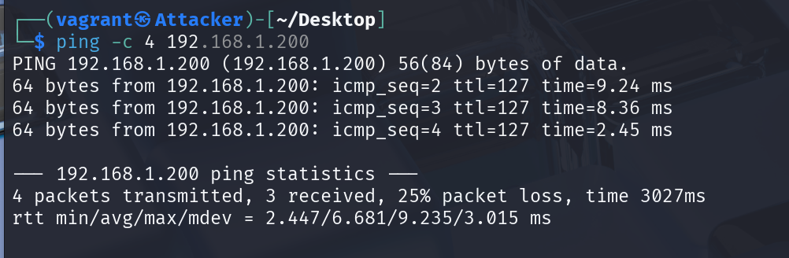
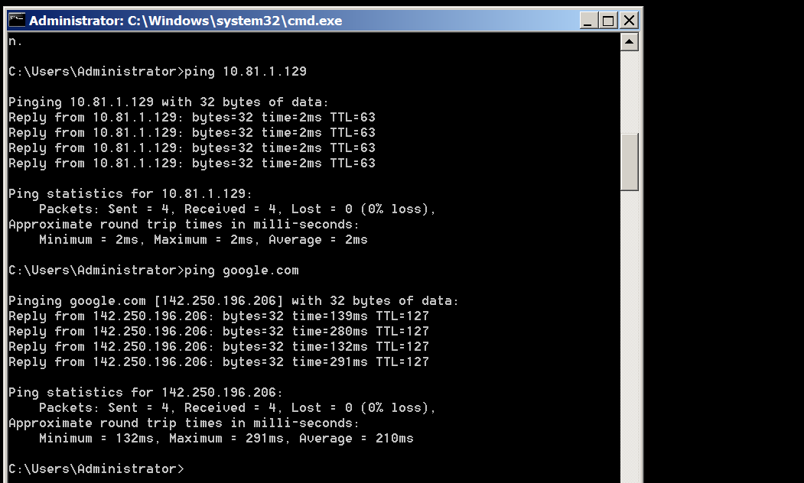

## Information about machines in the model

| Machine | Interface | Network | IP Address |
|-----|-----------|------|------------|
| **Router** | eth0 | NAT | 192.168.100.129 |
| | eth1 | VMnet2 (Host-Only) | 10.81.1.1 |
| | eth2 | VMnet3 (Host-Only) | 192.168.1.1 |
| **Attacker** | eth0 | VMnet2 (Host-Only) | 10.81.1.129 |
| **Snort** | eth0 | NAT | 192.168.100.128 |
| | eth1 | VMnet2 (Host-Only) | (no static IP) |
| | eth2 | VMnet3 (Host-Only) | (no static IP) |
| **Victim** | eth0 | VMnet3 (Host-Only) | 192.168.1.200 |

## 1. VMnet Configuration



## 2. Configuring IP addresses for interfaces

### Router

```bash
sudo nano /etc/netplan/*.yaml
```

Configuration content:
```yaml
network:
  version: 2
  renderer: networkd
  ethernets:
    eth0:
      dhcp4: true

    eth1:
      dhcp4: no
      addresses:
        - 10.81.1.1/24
      nameservers:
        addresses:
          - 10.81.1.1
          - 8.8.8.8

    eth2:
      dhcp4: no
      addresses:
        - 192.168.1.1/24
      nameservers:
        addresses:
          - 192.168.1.1
          - 8.8.8.8
```

Apply configuration:
```bash
sudo netplan apply
```

Check configuration:

```bash
vagrant@Router:~$ ip add show
1: lo: <LOOPBACK,UP,LOWER_UP> mtu 65536 qdisc noqueue state UNKNOWN group default qlen 1000
    link/loopback 00:00:00:00:00:00 brd 00:00:00:00:00:00
    inet 127.0.0.1/8 scope host lo
       valid_lft forever preferred_lft forever
    inet6 ::1/128 scope host noprefixroute
       valid_lft forever preferred_lft forever
2: eth0: <BROADCAST,MULTICAST,UP,LOWER_UP> mtu 1500 qdisc fq_codel state UP group default qlen 1000
    link/ether 00:0c:29:36:2d:1f brd ff:ff:ff:ff:ff:ff
    altname enp11s0
    altname ens192
    inet 192.168.100.129/24 metric 100 brd 192.168.100.255 scope global dynamic eth0
       valid_lft 1610sec preferred_lft 1610sec
    inet6 fe80::20c:29ff:fe36:2d1f/64 scope link
       valid_lft forever preferred_lft forever
3: eth1: <BROADCAST,MULTICAST,UP,LOWER_UP> mtu 1500 qdisc fq_codel state UP group default qlen 1000
    link/ether 00:0c:29:36:2d:29 brd ff:ff:ff:ff:ff:ff
    altname enp2s1
    altname ens33
    inet 10.81.1.1/24 brd 10.81.1.255 scope global eth1
       valid_lft forever preferred_lft forever
    inet6 fe80::20c:29ff:fe36:2d29/64 scope link
       valid_lft forever preferred_lft forever
4: eth2: <BROADCAST,MULTICAST,UP,LOWER_UP> mtu 1500 qdisc fq_codel state UP group default qlen 1000
    link/ether 00:0c:29:36:2d:33 brd ff:ff:ff:ff:ff:ff
    altname enp2s2
    altname ens34
    inet 192.168.1.1/24 brd 192.168.1.255 scope global eth2
       valid_lft forever preferred_lft forever
    inet6 fe80::20c:29ff:fe36:2d33/64 scope link
       valid_lft forever preferred_lft forever
```

### Attacker
```bash
└─$ ip add show      
1: lo: <LOOPBACK,UP,LOWER_UP> mtu 65536 qdisc noqueue state UNKNOWN group default qlen 1000
    link/loopback 00:00:00:00:00:00 brd 00:00:00:00:00:00
    inet 127.0.0.1/8 scope host lo
       valid_lft forever preferred_lft forever
    inet6 ::1/128 scope host noprefixroute 
       valid_lft forever preferred_lft forever
2: eth0: <BROADCAST,MULTICAST,UP,LOWER_UP> mtu 1500 qdisc fq_codel state UP group default qlen 1000
    link/ether 00:0c:29:4c:60:a5 brd ff:ff:ff:ff:ff:ff
    inet 10.81.1.129/24 brd 10.81.1.255 scope global dynamic noprefixroute eth0
       valid_lft 916sec preferred_lft 691sec
    inet6 fe80::cd6c:f1ea:f3c9:6c08/64 scope link 
       valid_lft forever preferred_lft forever
```

### Snort
Enable Snort interfaces:
```bash
sudo ip link set ens33 up
sudo ip link set ens34 up
```

Note: Snort IDS/IPS is configured without static IP addresses on interfaces eth1 and eth2 to work in transparent bridge mode.
```bash
vagrant@Snort:/etc/netplan$ ip a
1: lo: <LOOPBACK,UP,LOWER_UP> mtu 65536 qdisc noqueue state UNKNOWN group default qlen 1000
    link/loopback 00:00:00:00:00:00 brd 00:00:00:00:00:00
    inet 127.0.0.1/8 scope host lo
       valid_lft forever preferred_lft forever
    inet6 ::1/128 scope host noprefixroute
       valid_lft forever preferred_lft forever
2: eth0: <BROADCAST,MULTICAST,UP,LOWER_UP> mtu 1500 qdisc fq_codel state UP group default qlen 1000
    link/ether 00:0c:29:27:a4:8c brd ff:ff:ff:ff:ff:ff
    altname enp11s0
    altname ens192
    inet 192.168.100.128/24 metric 100 brd 192.168.100.255 scope global dynamic eth0
       valid_lft 953sec preferred_lft 953sec
    inet6 fe80::20c:29ff:fe27:a48c/64 scope link
       valid_lft forever preferred_lft forever
3: eth1: <BROADCAST,MULTICAST,UP,LOWER_UP> mtu 1500 qdisc fq_codel state UP group default qlen 1000
    link/ether 00:0c:29:27:a4:96 brd ff:ff:ff:ff:ff:ff
    altname enp2s1
    altname ens33
    inet6 fe80::20c:29ff:fe27:a496/64 scope link
       valid_lft forever preferred_lft forever
4: eth2: <BROADCAST,MULTICAST,UP,LOWER_UP> mtu 1500 qdisc fq_codel state UP group default qlen 1000
    link/ether 00:0c:29:27:a4:a0 brd ff:ff:ff:ff:ff:ff
    altname enp2s2
    altname ens34
    inet6 fe80::20c:29ff:fe27:a4a0/64 scope link
       valid_lft forever preferred_lft forever
```

### Victim




## 3. Configuring NAT outbound for Router

```bash
# Delete and reset all rules in filter and nat tables
iptables --flush
iptables --table nat --flush
iptables --delete-chain
iptables --table nat --delete-chain

# Set up IP Forwarding and Masquerade
iptables --table nat --append POSTROUTING --out-interface eth0 -j MASQUERADE
iptables --append FORWARD --in-interface eth1 -j ACCEPT

# Enable packet forwarding in kernel
echo 1 > /proc/sys/net/ipv4/ip_forward

# Apply configuration
service iptables restart
```
Check NAT configuration:

```bash
vagrant@Router:~$ sudo iptables -L -v -n
Chain INPUT (policy ACCEPT 24346 packets, 1616K bytes)
 pkts bytes target     prot opt in     out     source               destination

Chain FORWARD (policy ACCEPT 30868 packets, 60M bytes)
 pkts bytes target     prot opt in     out     source               destination
 1673  178K ACCEPT     0    --  eth1   *       0.0.0.0/0            0.0.0.0/0

Chain OUTPUT (policy ACCEPT 14637 packets, 1194K bytes)
 pkts bytes target     prot opt in     out     source               destination
vagrant@Router:~$ sudo iptables -t nat -L -v -n
Chain PREROUTING (policy ACCEPT 4691 packets, 353K bytes)
 pkts bytes target     prot opt in     out     source               destination

Chain INPUT (policy ACCEPT 3343 packets, 242K bytes)
 pkts bytes target     prot opt in     out     source               destination

Chain OUTPUT (policy ACCEPT 1697 packets, 133K bytes)
 pkts bytes target     prot opt in     out     source               destination

Chain POSTROUTING (policy ACCEPT 174 packets, 12363 bytes)
 pkts bytes target     prot opt in     out     source               destination
 2810  226K MASQUERADE  0    --  *      eth0    0.0.0.0/0            0.0.0.0/0
```
Test connection from Attacker:
```bash
──(vagrant㉿Attacker)-[~/Desktop]
└─$ traceroute google.com
traceroute to google.com (142.250.196.206), 30 hops max, 60 byte packets
 1  10.81.1.1 (10.81.1.1)  2.002 ms  1.898 ms  2.326 ms
 2  192.168.100.2 (192.168.100.2)  2.602 ms  2.506 ms  2.425 ms
```
## 4. Installing and configuring Snort
```bash
sudo apt update
sudo apt install snort
```

Address range for the local network is '192.168.1.0/24'

```bash
sudo snort --daq-list
sudo rm -rf /etc/snort/rules/*
sudo touch /etc/snort/rules/local.rules
```
Configure Snort:
```bash
sudo nano /etc/snort/local-sno.conf

config daq: afpacket
config daq_mode: inline

include /etc/snort/rules/local.rules
```

Check configuration:
```bash
sudo snort -T -c /etc/snort/local-snort.conf -Q -i ens33:ens34
```

Start Snort in IPS mode:
```bash
sudo snort -c /etc/snort/local-snort.conf -Q -i ens33:ens34
```

## **4. Check connection**

- Attacker connects to network through router


- Attacker can ping the Victim


Victim can connect to the internet through Router


- Snort records ICMP packets passing through the network
```bash
vagrant@Snort:/etc/netplan$ cat /var/log/snort/alert
[**] [1:1000001:1] Test ICMP Packet [**]
[Priority: 0]
05/19-08:25:34.487492 192.168.1.200 -> 10.81.1.129
ICMP TTL:128 TOS:0x0 ID:228 IpLen:20 DgmLen:60
Type:8  Code:0  ID:1   Seq:8  ECHO

[**] [1:1000001:1] Test ICMP Packet [**]
[Priority: 0]
05/19-08:25:34.488741 10.81.1.129 -> 192.168.1.200
ICMP TTL:63 TOS:0x0 ID:7899 IpLen:20 DgmLen:60
Type:0  Code:0  ID:1  Seq:8  ECHO REPLY

[**] [1:1000001:1] Test ICMP Packet [**]

[**] [1:1000001:1] Test ICMP Packet [**]
[Priority: 0]
05/19-08:25:41.379023 192.168.1.200 -> 142.250.196.206
ICMP TTL:128 TOS:0x0 ID:238 IpLen:20 DgmLen:60
Type:8  Code:0  ID:1   Seq:13  ECHO

[**] [1:1000001:1] Test ICMP Packet [**]
[Priority: 0]
05/19-08:25:41.669911 142.250.196.206 -> 192.168.1.200
ICMP TTL:127 TOS:0x0 ID:1454 IpLen:20 DgmLen:60
Type:0  Code:0  ID:1  Seq:13  ECHO REPLY
```